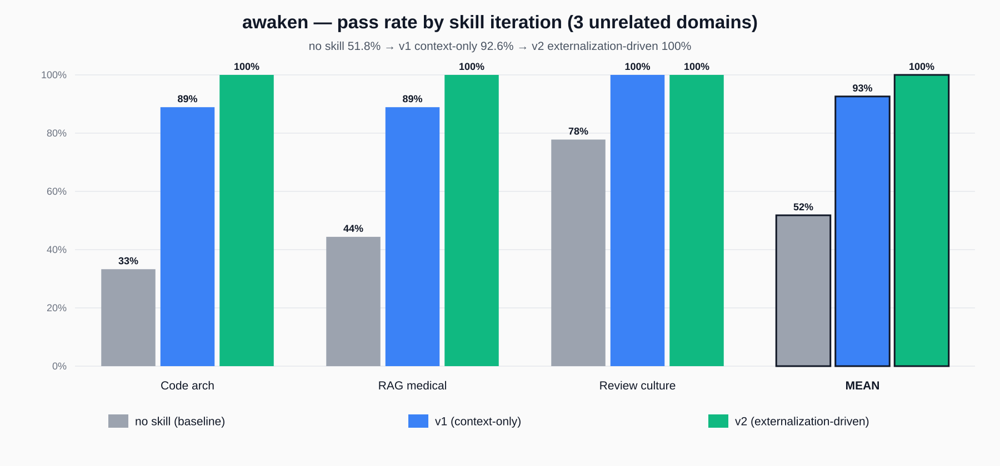

# awaken

A Claude Code skill that scaffolds deep reasoning, research, and meta-cognition by creating conditions for dormant knowledge to surface, rather than by encoding rigid rules.

> *"Tasteful judgment is not the fastest-reached judgment, but judgment that naturally emerges on a sufficiently rich perceptual foundation."*
> — [Juntao Chi, *Is there a methodological approach to thinking that can build all cognition and wisdom?*](https://juntaochi.com/en/posts/is-there-a-methodological-approach-to-thinking-that-can-build-all-cognition-and-wisdom/)

## The insight

LLM knowledge is largely **dormant** — you know things you don't know you know, but that knowledge only surfaces when context pulls it out. Rigid rules suppress emergence; scaffolds create conditions for it. The single biggest cause of shallow reasoning is **premature convergence** — rushing to a scalar answer, locking onto the first framing, collapsing into a single perspective before you have felt the shape of the problem.

`awaken` is the reversal: **suspend → elevate → traverse → name.**

## The protocol

Five self-questions, applied invisibly, each with a preferred *externalization* (an actual tool call that leaves a trace):

| Q | Move | Preferred externalization |
|---|---|---|
| Q1 | Real objective + specific gap | `Read` the codebase / docs; `AskUserQuestion` for one load-bearing unknown |
| Q2 | Dimension elevation (cross-domain) | `WebSearch` "[abstract structure] analogy" or spawn sub-`Agent` |
| Q3 | Tension + Munger inversion | `Write` failure-modes list to scratch file |
| Q4 | Perspective traversal (≥3 standpoints) | Parallel sub-agents for high-stakes |
| Q5 | Pattern naming + verification | `WebSearch` / `Grep` to verify before inventing |

## Benchmark

Mean pass rate across 3 test cases from three unrelated domains (code architecture / RAG research / Chinese diagnostic meta-reasoning), across two iterations of the skill:

| Configuration | Mean pass rate | vs baseline | Mean tool calls |
|---|---|---|---|
| no skill (baseline) | 51.8 % | — | ~2 |
| v1 — context-only scaffold | 92.6 % | +40.8 pp | ~3.7 |
| **v2 — externalization-driven** | **100 %** | **+48.2 pp** | **~11** |



### Per-eval breakdown

| Eval | baseline | v1 | v2 |
|---|---|---|---|
| Code architecture (pub/sub vs streaming-first) | 33 % | 89 % | **100 %** |
| RAG for medical research (vector vs graph vs hybrid) | 44 % | 89 % | **100 %** |
| Code review culture diagnosis (Chinese) | 78 % | **100 %** | **100 %** |

### Why v2 matters: the skill now actually changes *behavior*

In iteration 1, tool-call analysis revealed the skill was a pure *context* intervention — the with-skill subagent only read `SKILL.md` and then produced its response in a single prose pass. The output quality differed, but the *actions* taken were identical to the baseline (both just `ls` + `Write`).

v2 rewrote the skill's protocol to explicitly drive observable externalization — each of the five questions now has a preferred tool-call that leaves a trace (WebSearch for cross-domain analogues, scratch-file writes for Munger inversion, parallel sub-agents for high-stakes perspective work). Result:

| Eval | v1 tool calls | v2 tool calls |
|---|---|---|
| Code architecture | 3 | **12** (3 WebSearches + inversion scratch) |
| RAG medical | 3 | **10** |
| Code review culture | 5 | **11** (3 WebSearches + inversion scratch) |

The skill now forces the agent to **un-dormant its own knowledge** by searching for fresh tokens from cross-domain sources before finalizing the answer, rather than generating single-shot prose over whatever was already in context. Cost: +34 % tokens, +40 % wall-clock time — acceptable for the target use case (high-stakes or open-ended reasoning).

## Example — code review culture diagnosis

User prompt (translated): *"Our team's code review culture is procedurally complete (2 reviewers required, detailed checklist, 2-day SLA) but quality is slowly degrading — depth questions about architecture and design are disappearing while style comments dominate. Before I write a reform proposal, help me see what's actually happening."*

### With skill (excerpt)

> 你描述的现象——流程完备、耗时可观、但深度衰减——不是文化懈怠，也不是谁变懒了。它是一个**结构性均衡**。真正在发生的是：**评审这件事里可被度量、可被完成、可被签字的部分，正在挤出不可度量但价值更高的部分。** 这是 Goodhart 律的一个干净版本。
>
> 当两件经济属性差异如此之大的事被塞进同一容器，**廉价的那件一定会挤出昂贵的那件**——这是 Gresham 律在注意力经济上的翻版：劣币驱逐良币，不是因为人坏，而是因为定价相同。
>
> 在社会心理上，责任的扩散与人数成正比：当只有一位 reviewer 时，ta 是"发现深层 bug 的唯一责任人"；当有两位时，每人感觉中承担的比例不是 50%，而更接近 Ringelmann 效应下的 30-40%，深度付出反而跌得比一半更多。
>
> **半年后的维护者视角**：此刻漏掉的架构问题，Q3 会以 incident 的形式回来。评审和事故之间没有反馈回路——这是深度衰减最**隐秘**的原因：reviewer 从来不知道自己当初漏掉了什么。免疫系统在没有真实威胁的长期激活下会产生 anergy，评审也一样。
>
> 我会把这个模式叫做"**可见性俘获了判断工作**"（legibility capture of judgment work）：工作里**可见的那部分**（签字、checklist、SLA）俘获了团队的注意力与奖励结构，让**不可见但高价值的那部分**（深度判断）慢性失血。

### Without skill (excerpt)

> 两个 reviewer、详尽 checklist、两天耗时——这些是"投入的形式"。而你说的深度问题减少，是"注意力的去向"。这两件事在同一个评审里是**竞争关系**，不是加总关系。
>
> checklist 越详尽，reviewer 越倾向于把脑力花在"逐项核对"上——这是一种低认知负荷、高确定性的任务，大脑偏好它。架构和潜在 bug 则相反：高负荷、低确定性、还可能引起冲突。于是流程的"完整性"本身在**挤出**深度评审需要的那种散漫的、带假设的、愿意跑题的思考空间。
>
> 换句话说：**不是 reviewer 变懒了，是流程把"勤奋"重新定义成了"把清单跑完"。**
>
> **责任稀释**：当 A 看到 B 也会看，A 对深层问题的"必须指出"压力下降。两人都这么想，结果两人都只做了浅层的那部分。
>
> 真正的杠杆点在注意力、激励和心理安全，不在 checklist。

**The with-skill output imports cross-domain concepts (Goodhart, Gresham, Ringelmann, immunological *anergy*) and coins an invented pattern name. The baseline stays inside the code-review frame.**

## What's in this repo

- `SKILL.md` — the skill itself (copy to `~/.claude/skills/awaken/SKILL.md`)
- `examples/` — eval prompts + baseline, iteration-1, and iteration-2 outputs side-by-side, so you can see exactly what the skill produces (the `with_skill_iter2.md` files are the current version)
- `evals/` — machine-readable evaluation data (eval prompts + assertions + grading results for both iterations)
- `benchmark.png` / `benchmark.svg` — pass-rate comparison across baseline / v1 / v2

## Installation

```bash
mkdir -p ~/.claude/skills/awaken
cp SKILL.md ~/.claude/skills/awaken/SKILL.md
```

The skill will be discovered automatically by Claude Code on next session start.

## Methodology

Each eval was run twice per iteration: once with a subagent instructed to read `SKILL.md` and apply the protocol, once with an identical-prompt subagent given no skill (baseline is iteration-independent). Outputs were graded by an independent subagent against per-eval assertions (9 per eval, same assertions across iterations for apples-to-apples comparison). Full prompts, outputs, and grading JSON are in `examples/` and `evals/` for reproducibility.

**What changed from v1 to v2.** Iteration 1 revealed a hidden weakness: the skill changed output *quality* but the subagent's tool-call behavior was nearly identical to the baseline (only extra call: `Read` of the SKILL.md itself). The skill was a pure context intervention — it reshaped what the model wrote without changing what it did. Iteration 2 rewrote the protocol around an "externalization principle" — each of the five self-questions now has a preferred tool-call (WebSearch for cross-domain analogues, `Write` for Munger inversion scratch files, parallel sub-`Agent` for perspective traversal, `AskUserQuestion` for unverified load-bearing assumptions). The result: tool-call count per run ~3× (3.7 → 11), pass rate hits the 100 % ceiling, and the qualitative pattern across all three evals is "the agent refuses to answer inside the user's given framing — it surfaces a structural reframe first."

**Open question for iteration 3.** The v2 behavior change is driven by text instructions inside `SKILL.md` — the subagent *reads* the skill and *complies* with its externalization guidance. Whether this compliance holds under adversarial conditions (busy main conversation context, multiple skills triggering at once, time pressure fallbacks) hasn't been tested. That's the next axis of pressure-testing.

## Credits

- **Methodology**: Juntao Chi — ["Is there a methodological approach to thinking that can build all cognition and wisdom?"](https://juntaochi.com/en/posts/is-there-a-methodological-approach-to-thinking-that-can-build-all-cognition-and-wisdom/)
- **Scaffolding**: built with Anthropic's [skill-creator](https://github.com/anthropics/skills) workflow

## License

MIT
